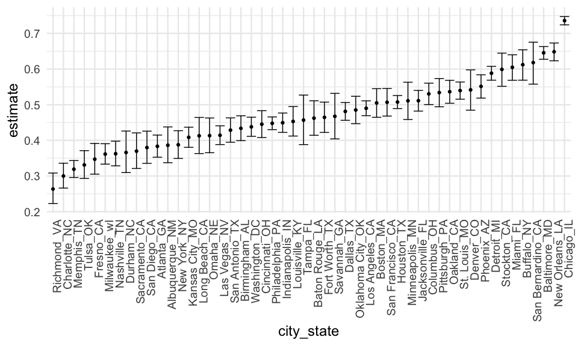
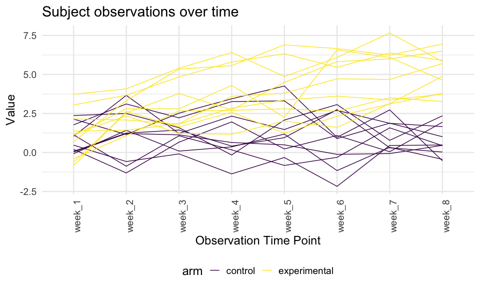

Homework5
================
Isabel Nelson
11/10/2020

### Problem 1

Read in the data, from course website (originally from Washington Post).
Case\_when is basically and if/then statement to create a new variable
resolved that has a specific values when disposition is a certain value.

``` r
homicide_df <- 
  read_csv("data1/homicide-data.csv") %>% 
  mutate(
    city_state = str_c(city, state, sep = "_"),
    resolved = case_when(
      disposition == "Closed without arrest" ~ "unsolved", 
      disposition == "Open/No arrest" ~ "unsolved", 
      disposition == "Closed by arrest" ~ "solved",
    )
  ) %>% 
  select(city_state, resolved) %>% 
  filter(city_state != "Tulsa_AL")
```

Explore the dataset

``` r
aggregate_df <-
  homicide_df %>% 
  group_by(city_state) %>% 
  summarize(
    hom_total = n(), 
    hom_unsolved = sum(resolved == "unsolved")
  )
```

Try prop test for a single city. This gives some statistics,
particularly of interest a confidence interval for the estimated
proportion for unsolved homicides in that city. Use broom::tidy to make
the output of prop.test easily extractable for other uses (tibble).

``` r
prop.test(
  aggregate_df %>% filter(city_state == "Baltimore_MD") %>% pull(hom_unsolved), 
  aggregate_df %>% filter(city_state == "Baltimore_MD") %>% pull(hom_total)) %>% 
  broom::tidy()
```

    ## # A tibble: 1 x 8
    ##   estimate statistic  p.value parameter conf.low conf.high method    alternative
    ##      <dbl>     <dbl>    <dbl>     <int>    <dbl>     <dbl> <chr>     <chr>      
    ## 1    0.646      239. 6.46e-54         1    0.628     0.663 1-sample… two.sided

Now do iteration. Going straight to a map, not doing the intermediate
step of creating a for loop. In this case map takes pair of input
columns (hom\_unsolved and hom\_total), outputs a column (prop\_tests)
which is added to the dataframe. Pull prop\_tests column to check it.

``` r
aggregate_df %>% 
  mutate(
    prop_tests = map2(.x = hom_unsolved, .y = hom_total, ~prop.test(x = .x, n = .y))
  )
```

    ## # A tibble: 50 x 4
    ##    city_state     hom_total hom_unsolved prop_tests
    ##    <chr>              <int>        <int> <list>    
    ##  1 Albuquerque_NM       378          146 <htest>   
    ##  2 Atlanta_GA           973          373 <htest>   
    ##  3 Baltimore_MD        2827         1825 <htest>   
    ##  4 Baton Rouge_LA       424          196 <htest>   
    ##  5 Birmingham_AL        800          347 <htest>   
    ##  6 Boston_MA            614          310 <htest>   
    ##  7 Buffalo_NY           521          319 <htest>   
    ##  8 Charlotte_NC         687          206 <htest>   
    ##  9 Chicago_IL          5535         4073 <htest>   
    ## 10 Cincinnati_OH        694          309 <htest>   
    ## # … with 40 more rows

Use map to clean up every entry in the prop\_tests column. Now we have a
list with a bunch of tibbles (tidy\_tests output) inside the list.
Unnest expands all those into their own rows.

``` r
results_df <-
aggregate_df %>% 
  mutate(
    prop_tests = map2(.x = hom_unsolved, .y = hom_total, ~prop.test(x = .x, n = .y)),
    tidy_tests = map(.x = prop_tests, ~broom::tidy(.x))
  ) %>% 
  select(-prop_tests) %>% 
  unnest(tidy_tests) %>% 
  select(city_state, estimate, conf.low, conf.high)
```

Now we can visualize the results in ggplot.

``` r
results_df %>% 
  mutate(city_state = fct_reorder(city_state, estimate)) %>% 
  ggplot(aes(x = city_state, y = estimate)) +
  geom_point() +
  geom_errorbar(aes(ymin = conf.low, ymax = conf.high))
```



### Problem 2

Import datasets. Create a dataframe that has the names of all the files
in the data folder of interest. Mutate to create a column with the
appropriate relative path name. Create a new variable for what treatment
arm the participant is in and ID. Map read\_csv to each path name
resulting in a dataframe with one column with the file name and one
column with the dataframe for each participant. Tidy the final dataset
by pivoting and remove unneeded columns.

``` r
paths_df <-
  tibble(
    path = list.files("data2")) %>% 
  mutate(
    path = str_c("data2/", path), 
    num = str_sub(path, -6, -5),
    arm = case_when(
      str_detect(path, "con") ~ "control",
      str_detect(path, "exp") ~ "experimental"),
    id = str_c(arm, num, sep = "_"), 
    data = map(path, read_csv)) %>% 
  unnest(data) %>% 
  pivot_longer(
    week_1:week_8, 
    names_to = "obs_week", 
    values_to = "obs_value") %>% 
  select(-path, -num) 
```

Create the graph to visualize participant observations by week.

``` r
paths_df %>% 
ggplot(aes(x = obs_week, y = obs_value)) + 
  geom_line() + 
  aes(colour = arm) + 
  xlab("Observation Time Point") +
  ylab("Value") +
  labs(title = "Subject observations over time") +
  aes(group = factor(id))
```


From this graph we can see that generally participants in the
experimental arm had higher values than those in the control arm over
the study period. This is especially noticeable in the later weeks. At
the beginning both arms were closer together and participant values were
overlapping, but as the observations continue in time, the groups
diverge and by week 8 there is no overlap between participants in
control versus experimental arms - all 10 experimental participants have
values that are higher than the control arm participants.

### Problem 3

Simulate a bunch of datasets and p-values for the hypothesis test that
under null the mean = 0 (use the function we wrote in class, but modify
for p-value and estimate).
