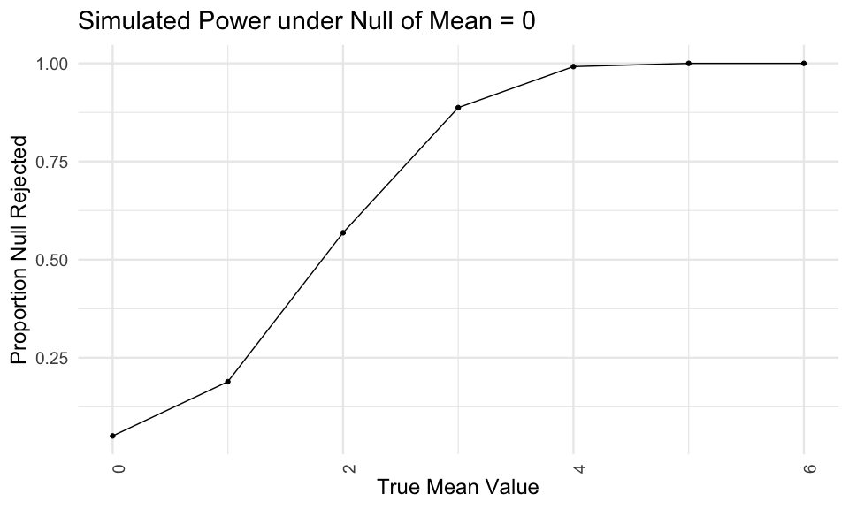
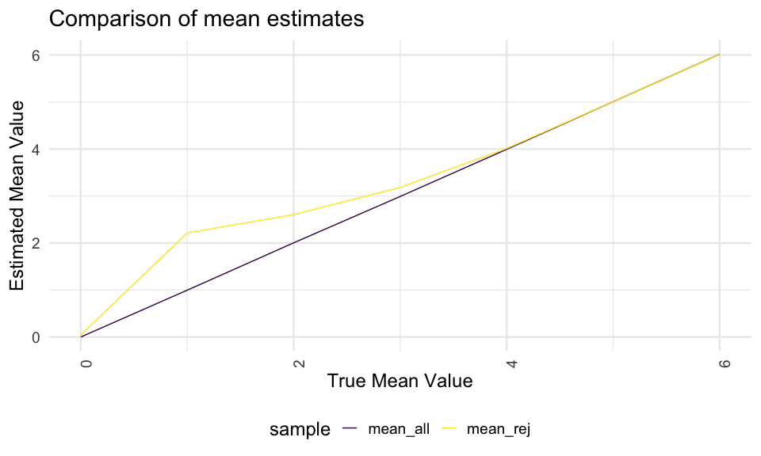

Homework5
================
Isabel Nelson
11/10/2020

### Problem 1

Read in the data, from course website, originally from Washington Post.
(Note: case\_when is basically an if/then statement to create a new
variable “resolved” that has a specific value when “disposition” is a
certain value.)

``` r
homicide_df <- 
  read_csv("data1/homicide-data.csv") %>% 
  mutate(
    city_state = str_c(city, state, sep = "_"),
    resolved = case_when(
      disposition == "Closed without arrest" ~ "unsolved", 
      disposition == "Open/No arrest" ~ "unsolved", 
      disposition == "Closed by arrest" ~ "solved",
    )
  ) %>% 
  select(city_state, resolved) %>% 
  filter(city_state != "Tulsa_AL")
```

Explore the dataset

``` r
aggregate_df <-
  homicide_df %>% 
  group_by(city_state) %>% 
  summarize(
    hom_total = n(), 
    hom_unsolved = sum(resolved == "unsolved")
  )
```

Try prop test for a single city. This gives some statistics,
particularly of interest a confidence interval for the estimated
proportion for unsolved homicides in that city. Use broom::tidy to make
the output of prop.test easily extractable for other uses (tibble).

``` r
prop.test(
  aggregate_df %>% filter(city_state == "Baltimore_MD") %>% pull(hom_unsolved), 
  aggregate_df %>% filter(city_state == "Baltimore_MD") %>% pull(hom_total)) %>% 
  broom::tidy()
```

    ## # A tibble: 1 x 8
    ##   estimate statistic  p.value parameter conf.low conf.high method    alternative
    ##      <dbl>     <dbl>    <dbl>     <int>    <dbl>     <dbl> <chr>     <chr>      
    ## 1    0.646      239. 6.46e-54         1    0.628     0.663 1-sample… two.sided

Now do iteration. Going straight to a map, not doing the intermediate
step of creating a for loop. In this case map takes pair of input
columns (hom\_unsolved and hom\_total), outputs a column (prop\_tests)
which is added to the dataframe.

``` r
aggregate_df %>% 
  mutate(
    prop_tests = map2(.x = hom_unsolved, .y = hom_total, ~prop.test(x = .x, n = .y))
  )
```

    ## # A tibble: 50 x 4
    ##    city_state     hom_total hom_unsolved prop_tests
    ##    <chr>              <int>        <int> <list>    
    ##  1 Albuquerque_NM       378          146 <htest>   
    ##  2 Atlanta_GA           973          373 <htest>   
    ##  3 Baltimore_MD        2827         1825 <htest>   
    ##  4 Baton Rouge_LA       424          196 <htest>   
    ##  5 Birmingham_AL        800          347 <htest>   
    ##  6 Boston_MA            614          310 <htest>   
    ##  7 Buffalo_NY           521          319 <htest>   
    ##  8 Charlotte_NC         687          206 <htest>   
    ##  9 Chicago_IL          5535         4073 <htest>   
    ## 10 Cincinnati_OH        694          309 <htest>   
    ## # … with 40 more rows

Use map to clean up every entry in the prop\_tests column. Now we have a
list with a bunch of tibbles (tidy\_tests output) inside the list.
Unnest expands all those into their own rows.

``` r
results_df <-
aggregate_df %>% 
  mutate(
    prop_tests = map2(.x = hom_unsolved, .y = hom_total, ~prop.test(x = .x, n = .y)),
    tidy_tests = map(.x = prop_tests, ~broom::tidy(.x))
  ) %>% 
  select(-prop_tests) %>% 
  unnest(tidy_tests) %>% 
  select(city_state, estimate, conf.low, conf.high)
```

Now we can visualize the results in ggplot.

``` r
results_df %>% 
  mutate(city_state = fct_reorder(city_state, estimate)) %>% 
  ggplot(aes(x = city_state, y = estimate)) +
  geom_point() +
  geom_errorbar(aes(ymin = conf.low, ymax = conf.high))
```


### Problem 2

Import datasets. Create a dataframe that has the names of all the files
in the data folder of interest. Mutate to create a column with the
appropriate relative path name. Create a new variable for what treatment
arm the participant is in and ID. Map read\_csv to each path name
resulting in a dataframe with one column with the file name and one
column with the dataframe for each participant. Tidy the final dataset
by pivoting and remove unneeded columns.

``` r
paths_df <-
  tibble(
    path = list.files("data2")) %>% 
  mutate(
    path = str_c("data2/", path), 
    num = str_sub(path, -6, -5),
    arm = case_when(
      str_detect(path, "con") ~ "control",
      str_detect(path, "exp") ~ "experimental"),
    id = str_c(arm, num, sep = "_"), 
    data = map(path, read_csv)) %>% 
  unnest(data) %>% 
  pivot_longer(
    week_1:week_8, 
    names_to = "obs_week", 
    values_to = "obs_value") %>% 
  select(-path, -num) 
```

Create the graph to visualize participant observations by week.

``` r
paths_df %>% 
ggplot(aes(x = obs_week, y = obs_value)) + 
  geom_line() + 
  aes(colour = arm) + 
  xlab("Observation Time Point") +
  ylab("Value") +
  labs(title = "Subject observations over time") +
  aes(group = factor(id))
```


From this graph we can see that generally participants in the
experimental arm had higher values than those in the control arm over
the study period. This is especially noticeable in the later weeks. At
the beginning both arms were closer together and participant values were
overlapping, but as the observations continue in time, the groups
diverge and by week 8 there is no overlap between participants in
control versus experimental arms - all 10 experimental participants have
values that are higher than the control arm participants.

### Problem 3

Create a base function that takes in n, mu, and sigma (n and sigma
pre-specified) and outputs a tibble with the results from a t-test where
the null mean is zero and alpha = 0.05.

``` r
sim_mean_pval <- function(n = 30, mu, sigma = 5) {
  
  sim_data <- tibble(
    x = rnorm(n, mean = mu, sd = sigma),
  )
  
  sim_data %>% 
    t.test(mu = 0, conf.level = 0.95) %>% 
    broom::tidy() %>% 
    select(estimate, p.value)
}
```

Run the simulation: create a tibble with different mean value options,
then perform the function operation 5000 times for each mean value using
map. Condense these into a dataframe, remove the list column, and
unnest. Then create a new variable designating whether p-value is
rejected, and nest again.

``` r
sim_results <- 
  tibble(
    mean_val = c(0, 1, 2, 3, 4, 5, 6)
  ) %>% 
  mutate(
    output_list = map(.x = mean_val, ~ rerun(5000, sim_mean_pval(mu = .x))),
    output_df = map(output_list, bind_rows)
  ) %>% 
  select(-output_list) %>% 
  unnest(output_df) %>% 
  mutate(
    rejected = case_when(
      p.value <= 0.05 ~ "yes",
      p.value > 0.05 ~ "no")
  ) %>% 
  nest(data = estimate:rejected)
```

Create a function to calculate the proportion of times the null was
rejected.

``` r
calc_proportion <- function(df) {
  
  df %>% 
      {mutate(.,
      n_no = count(filter(., rejected == "no")), 
      n_yes = count(filter(., rejected == "yes")), 
      prop = n_yes / (n_no + n_yes)
      )}
}
```

Map function for each simulated mean value, then unnest data, remove
unnecessary columns, create a new column that is a vector and not a
dataframe so it will work with the graph, and then plot.

``` r
sim_results %>% 
  mutate(
    proportion_df = map(.x = data, ~calc_proportion(df = .x))
  ) %>% 
  select(-data) %>% 
  unnest(proportion_df) %>% 
  select(mean_val, prop) %>% 
  distinct(mean_val, prop) %>% 
  mutate(
    props = pull(prop) 
  ) %>% 
  ggplot(aes(x = mean_val, y = props)) + 
  geom_point() + geom_line() +
  xlab("True Mean Value") +
  ylab("Proportion Null Rejected") +
  labs(title = "Simulated Power under Null of Mean = 0")
```


From the graph we see that as effect size increases (as the true mean
value gets further away from the null of zero on the x-axis) the power
to reject the null increases as well (shown by the increasing proportion
of times that the null is rejected, on the y-value).

Create two new datasets to calculate average for all mean estimates and
only rejected mean estimates, then plot both on the same graph.

``` r
rejected_estimates <- 
  sim_results %>% 
  unnest(data) %>% 
  select(-p.value) %>%
  group_by(mean_val) %>% 
  filter(rejected == "yes") %>% 
  summarize(mean_rej = mean(estimate))
```

    ## `summarise()` ungrouping output (override with `.groups` argument)

``` r
all_estimates <-
  sim_results %>% 
  unnest(data) %>% 
  select(-p.value) %>%
  group_by(mean_val) %>% 
  summarize(mean_all = mean(estimate))
```

    ## `summarise()` ungrouping output (override with `.groups` argument)

``` r
left_join(rejected_estimates, all_estimates, by = "mean_val") %>%
  pivot_longer(mean_rej:mean_all, 
               names_to = "sample", 
               values_to = "estimate") %>% 
  ggplot(aes(x = mean_val, y = estimate, color = sample)) +
  geom_line() +
  xlab("True Mean Value") +
  ylab("Estimated Mean Value") +
  labs(title = "Comparison of mean estimates")
```


When we look at true mean values above 4, the sample average of mu
across tests where the null is rejected and the sample average of mu
across all tests are both approximately equal to the true value of mu.
However when we look at true mean values below 4, the sample average of
mu is approximately equal to the true value of mu only for the all tests
group. For the tests where the null is rejected, the true value of mu is
not equal to the average estimated mu, which we see from the divergent
yellow line.
